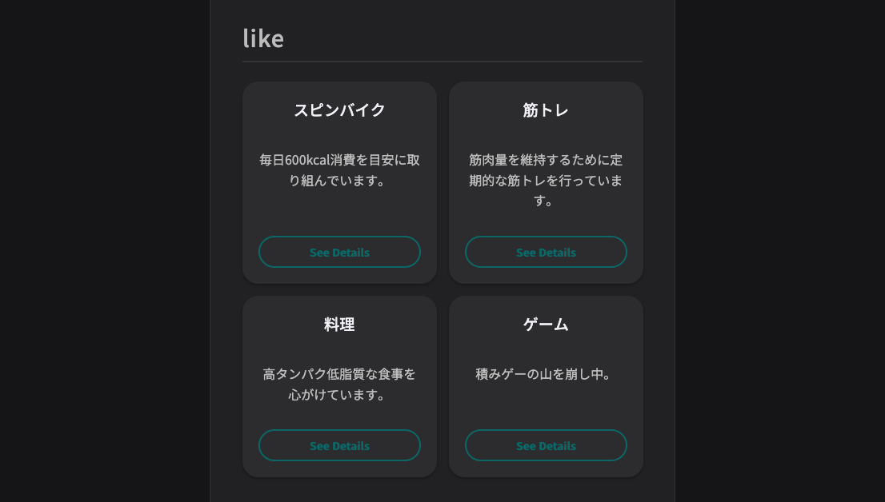
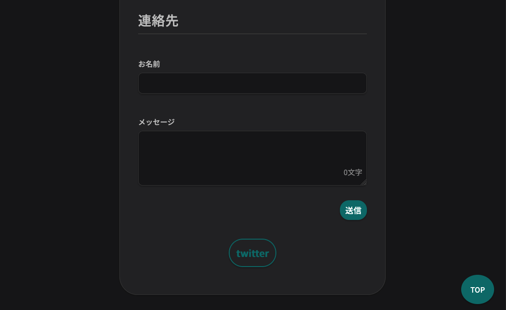

# 自己紹介ページ / introduce-page

JavaScript の練習用に作成した自己紹介ページです。

## **デモページ**: [https://fried-hosh.github.io/introduce-page/](https://fried-hosh.github.io/introduce-page/)

---

## ページ全体概要 / Screenshots


ページのヘッダー部分と自己紹介です。


趣味を紹介する「LIKE」セクションです。詳細表示機能も実装しています。


連絡先とお問い合わせフォームです。フォームのダミー送信機能も動作します。

---

## 実装機能 / Features

- HTML:

  - `<picture>`タグとメディアクエリを使用し、カラースキームに応じてプロフィール画像を切り替え
  - セマンティックを意識した html の記述

- CSS:

  - PC とスマートフォンの両 UI に対応したレスポンシブデザイン
  - CSS 変数を利用したテーマ切り替え
  - CSS アニメーションを利用したカードのフェードイン
  - Flexbox と Grid を用いたカードレイアウト

- JavaScript:
  - data 属性を利用した、モーダルウィンドウの動的表示
  - Intersection Observer によるスクロール制御
  - async / await を用いた、fetch による非同期ダミー送信
  - 入力内容をチェックするフォームバリデーション

---

## 使用技術 / Tech Stack

- HTML5
- CSS
- JavaScript

---

## 使い方 / Usage

### クローン

```bash
git clone https://github.com/fried-hosh/introduce-page.git
cd introduce-page
```

### ブラウザで開く

**macOS**

```bash
open index.html
```

**Windows**

```powershell
start index.html
```
